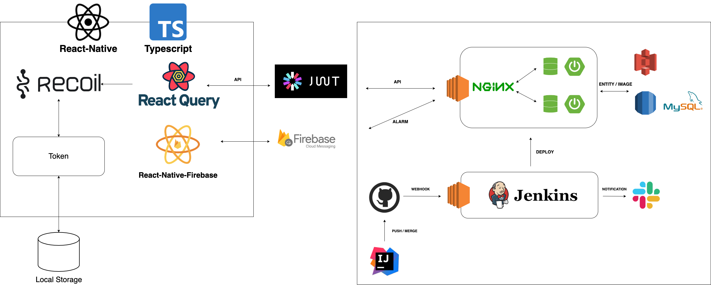
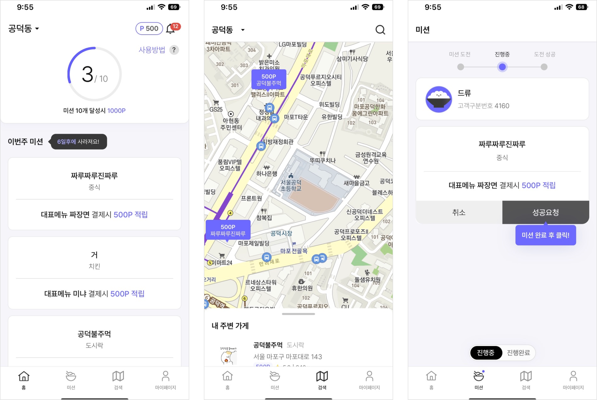
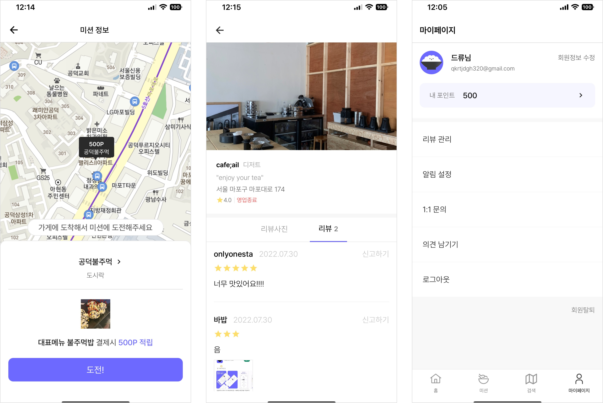
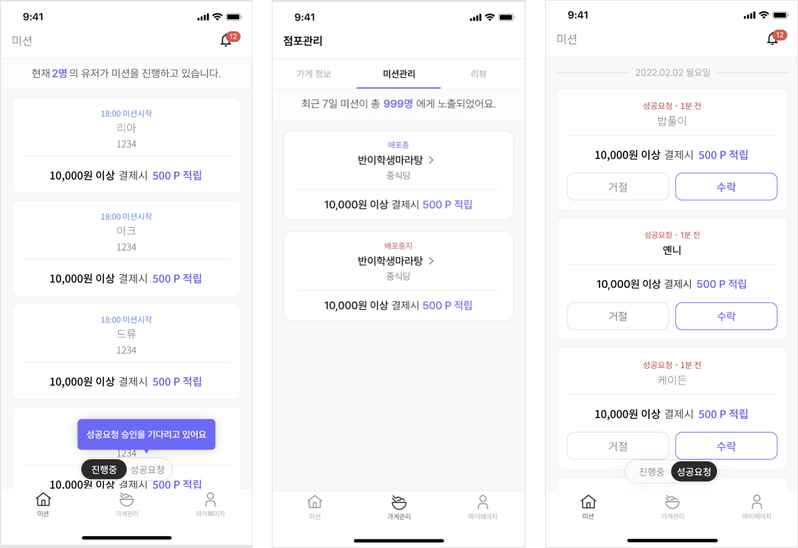

## App Introduction

Bobplace means place where you have meals (Bob means meal in korean).

The number of people who uses food delivery service is increasing and the delivery fee is getting expensive nowadays. Therefore many people starts to use pick up service to save the delivery fee.

- Expensive delivery fee is a burden to users and small restaurant owners
- We motivate users to go outside to have meals using points
- We provide a better way the small restaurant owners to get customers with better business margin.

Bobplace is an app that uses gamification to encourage users to go outside to have the meals to and solve the problem of delivery fee. I have developed two apps one for customers and one for restaurant owners.

---

## System Design

---

## Features Developed

### **Customer App**

- Google, Apple and kakao Social login, JWT token will refresh automatically when expired using Axios Interceptor and Autologon implemented.
- React-hook-form is used to handle the register data efficiently.
- Animated header that is responsive to the scroll, address update modal page and showing detail data on pressing mission cards.
- Real-time Data communication between customer app and restaurant owner app which refreshes user’s mission page to change mission status through Firebase Cloud Messaging.
- Show the restaurants near me with pins using the map from WebView. On click Pin, send data from WebView to React-native to open the modal. Infinite scroll on review images and contents about the restaurant.
- Uploading images and contents to add review. Have customized the existing rating library to apply our service rating style.

### **Restaurant Owner App**

- handling conditions of restaurant Social Logins, register restaurant information pages on register
- Shows the information of restaurant, Edit opening hours and other information, Check the number of mission exposures and mission content, page where restaurant owner can leave their comment on users review.
- Render users who are doing the mission, Render users who has completed their mission and requested for the approval
- Automatically refresh and update when user complete the mission

---

## Screenshots

### Customer App

### Restaunrant Owner App

---
